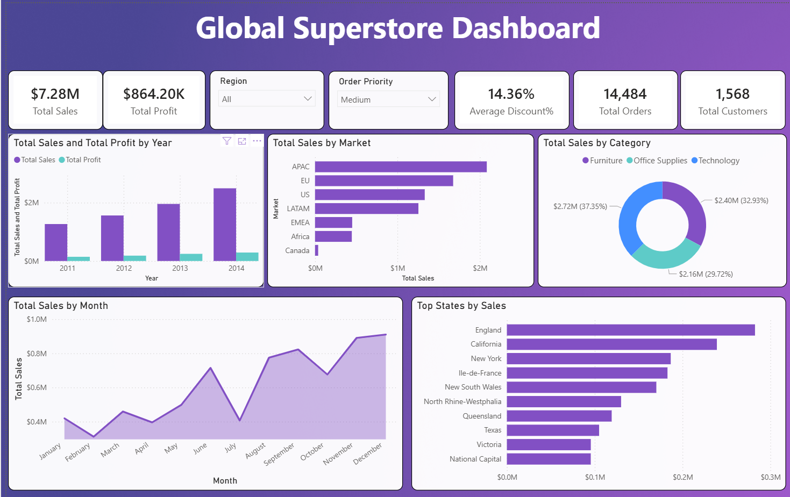

# 📊 Global Superstore Dashboard

## 🚀 Project Overview

The **Global Superstore Dashboard** is an interactive Business Intelligence solution developed in **Power BI** to analyze sales, profitability, customer behavior, and regional performance across global markets from **2011–2014**.

The dashboard provides executives and business stakeholders with actionable insights through interactive visualizations, KPI tracking, and trend analysis to support data-driven decision-making.

---



---


## 🎯 Business Objectives

* Monitor overall business performance.
* Analyze sales and profit trends over time.
* Identify top-performing markets and regions.
* Evaluate customer segments and order priorities.
* Discover opportunities to improve profitability.
* Support strategic planning through data visualization.

---

## 🛠️ Tools & Technologies

* **Power BI Desktop**
* **Power Query**
* **DAX (Data Analysis Expressions)**
* **Microsoft PowerPoint**
* **Global Superstore Dataset**

---

## 📂 Dataset Information

The dataset contains:

* Orders
* Customers
* Products
* Categories & Sub-Categories
* Markets & Regions
* Sales
* Profit
* Discounts
* Shipping Information

**Time Period:** 2011 – 2014

---

## 📈 Key Performance Indicators (KPIs)

| KPI              | Value    |
| ---------------- | -------- |
| Total Sales      | $7.28M   |
| Total Profit     | $864.20K |
| Average Discount | 14.36%   |
| Total Orders     | 14,484   |
| Total Customers  | 1,568    |
| Profit Margin    | ~12%     |

---

# Dashboard Features

## Executive Dashboard

Provides a high-level overview of business performance through KPI cards and summary visualizations.

### Included KPIs

* Total Sales
* Total Profit
* Average Discount
* Total Orders
* Total Customers

---

## Sales Analysis

### Visuals

* Sales Trend by Year
* Monthly Sales Trend
* Sales by Market
* Sales by Category

### Key Insights

* Sales increased from **$897K in 2011** to **$1.70M in 2014**.
* Overall sales growth exceeded **90%** during the analysis period.
* Q4 consistently generated the highest revenue.

---

## Market Performance Analysis

| Market | Sales  |
| ------ | ------ |
| APAC   | $1.97M |
| EU     | $1.55M |
| US     | $1.50M |
| LATAM  | $723K  |
| EMEA   | $256K  |
| Africa | $246K  |

### Insights

* APAC is the highest-performing market.
* EU and US contribute significantly to total revenue.
* Emerging markets offer future growth opportunities.

---

## Product Category Analysis

| Category        | Sales  |
| --------------- | ------ |
| Office Supplies | $3.46M |
| Technology      | $808K  |
| Furniture       | $520K  |

### Insights

* Office Supplies contributes the highest sales volume.
* Technology offers strong profitability potential.
* Furniture experiences higher discount pressure.

---

## Geographic Analysis

### Top States by Sales

1. England
2. California
3. New York
4. Île-de-France
5. New South Wales

### Insights

* Sales are concentrated in a few high-performing regions.
* Geographic analysis helps identify expansion opportunities.

---

## Customer Analysis

### Customer Segments

| Segment     | Share |
| ----------- | ----- |
| Consumer    | 51%   |
| Corporate   | 30%   |
| Home Office | 19%   |

### Order Priority Distribution

* Medium: 5,180 Orders
* High: 3,420 Orders
* Low: 3,054 Orders
* Critical: 2,830 Orders

---

## Profitability Analysis

| Metric               | Value  |
| -------------------- | ------ |
| Total Profit         | $864K  |
| Profit Margin        | ~12%   |
| Average Order Profit | $59.8  |
| Average Discount     | 14.36% |

### Findings

* High discount rates impact profitability.
* APAC contributes the highest profit.
* Margin optimization opportunities exist across categories.

---

## 🎨 Dashboard Design Highlights

* Interactive slicers for Region and Order Priority
* KPI summary cards
* Consistent purple-themed design
* Time-series visualizations
* Category and market analysis
* Clean and user-friendly layout

---


## 📁 Project Files

```text
├── global.pbix
├── Global_Superstore2.csv
├── Global_Superstore_Presentation.pptx
└── README.md
```

---

## 📌 Conclusion

The Global Superstore Dashboard delivers a comprehensive view of business performance through interactive reporting and advanced analytics. It enables stakeholders to monitor KPIs, identify growth opportunities, and make informed strategic decisions using data-driven insights.

---

**Author:** Ujjwal Kumar
**Tool:** Power BI
**Project Type:** Business Intelligence Dashboard
