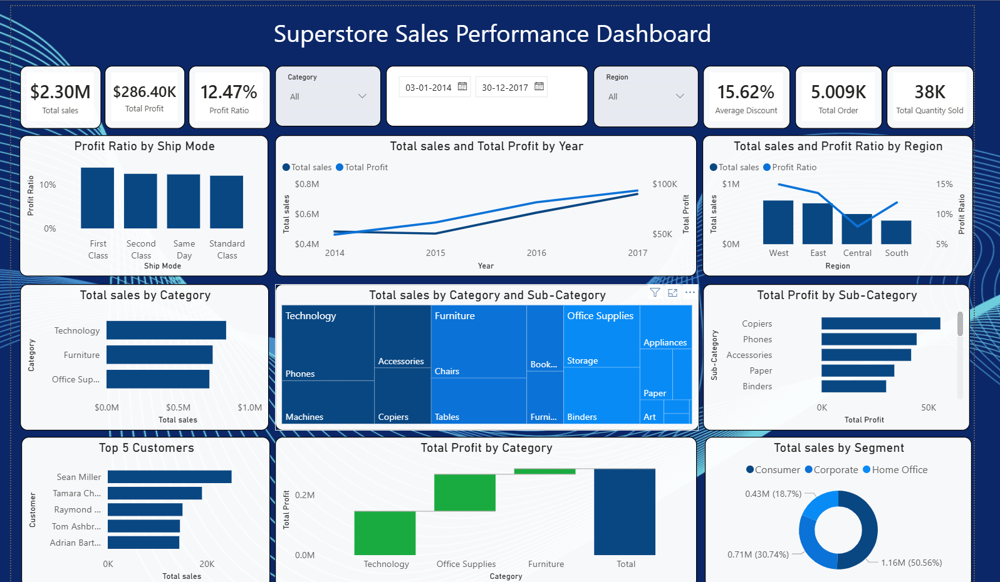

# Superstore Sales Performance Dashboard

## Overview
The **Superstore Sales Performance Dashboard** is an interactive Power BI dashboard designed to analyze retail sales performance from **2014 to 2017** using the Superstore dataset. The dashboard provides insights into sales, profit, discounts, customer behavior, product performance, and regional trends to support data-driven business decisions.

---

## Project Objective
The objective of this project is to:

- Monitor overall sales and profitability.
- Identify high-performing categories, products, and regions.
- Analyze the impact of discounts on profitability.
- Track sales growth over time.
- Discover valuable customers and business opportunities.
- Support strategic decision-making through visual analytics.

---

## Dataset Information

| Attribute | Value |
|------------|--------|
| Dataset | Superstore Sales Dataset |
| Records | 9,994 |
| Period | 2014 – 2017 |
| Tool Used | Microsoft Power BI |
| File Format | CSV |

### Key Fields
- Order Date
- Sales
- Profit
- Discount
- Quantity
- Category
- Sub-Category
- Region
- Segment
- Customer Name

---

## Dashboard Features

### KPI Cards
Displays key business metrics:

- **Total Sales:** $2.30M
- **Total Profit:** $286.40K
- **Profit Ratio:** 12.47%
- **Average Discount:** 15.62%
- **Total Orders:** 5,009
- **Total Quantity Sold:** 37,873

---

### Sales & Profit Trend Analysis
Tracks yearly performance from 2014 to 2017.

| Year | Sales | Profit |
|------|--------|---------|
| 2014 | $484K | $49.5K |
| 2015 | $471K | $61.6K |
| 2016 | $609K | $81.8K |
| 2017 | $733K | $93.4K |

**Insight:** Sales increased by approximately **51%** from 2014 to 2017.

---

### Sales by Category

| Category | Sales |
|-----------|--------|
| Technology | $836K |
| Furniture | $742K |
| Office Supplies | $719K |

**Insight:** Technology generated the highest revenue.

---

### Profit by Category

| Category | Profit |
|-----------|---------|
| Technology | $145K |
| Office Supplies | $122K |
| Furniture | $18K |

**Insight:** Furniture contributes significant sales but very low profit margins.

---

### Regional Performance

| Region | Sales |
|---------|--------|
| West | $725K |
| East | $679K |
| Central | $501K |
| South | $392K |

**Insight:** West region leads in both sales performance and profitability.

---

### Sub-Category Profit Analysis

Top-performing sub-categories:

1. Copiers
2. Phones
3. Accessories
4. Paper
5. Binders
6. Chairs

**Insight:** Copiers generate the highest profit among all sub-categories.

---

### Customer Analysis

Top customers by sales:

| Customer | Sales |
|------------|---------|
| Sean Miller | $25,043 |
| Tamara Chand | $19,052 |
| Raymond Buch | $15,117 |
| Tom Ashbrook | $14,596 |
| Adrian Barton | $14,474 |

**Observation:** Despite having the highest sales, Sean Miller contributes negative profitability due to heavy discounting.

---

### Segment Analysis

| Segment | Sales |
|----------|---------|
| Consumer | $1.16M |
| Corporate | $706K |
| Home Office | $430K |

**Insight:** Consumer segment accounts for more than 50% of total sales.

---

### Discount Impact Analysis

| Discount Band | Avg Profit per Order |
|---------------|----------------------|
| 0% | $66.9 |
| 1–10% | $96.1 |
| 11–20% | $24.7 |
| 21–30% | -$45.7 |
| 31–50% | -$156.3 |
| 51%+ | -$89.4 |

**Key Finding:** Orders discounted above **20%** become unprofitable on average.

---

## Business Insights

### Strong Revenue Growth
- Sales grew from **$484K** in 2014 to **$733K** in 2017.
- Consistent upward trend indicates healthy business expansion.

### Technology Drives Profitability
- Highest sales and profit contribution.
- Opportunity for additional investment and marketing.

### Furniture Requires Attention
- High revenue but low profitability.
- Review pricing and discount strategies.

### Regional Opportunity
- West region demonstrates best performance.
- Central region shows excessive discounting affecting margins.

### Discount Optimization
- Discounts above 20% negatively impact profit.
- Introduce stricter discount approval policies.

### Customer Profitability Review
- Evaluate customers generating high sales but low profits.
- Improve pricing agreements and product mix.

---

## Power BI Techniques Used

### Data Modeling
- Relationship management
- Star schema design

### DAX Measures
- Total Sales
- Total Profit
- Profit Ratio
- Average Discount
- Total Orders
- Quantity Sold

### Visualizations
- KPI Cards
- Line Charts
- Bar Charts
- Treemap
- Waterfall Chart
- Donut Chart
- Slicers
- Interactive Filters

---

## Files Included

- `supersales.pbix` — Power BI report file
- `Sample - Superstore(4).csv` — Source dataset
- `Superstore_Dashboard_Presentation.pptx` — Project presentation
- `Supersale.png` — Dashboard screenshot

---

## Recommendations

1. Limit discounts to a maximum of **20%**.
2. Focus growth efforts on the **Technology** category.
3. Improve profitability within the **Furniture** category.
4. Replicate successful strategies used in the **West** region.
5. Monitor customer profitability rather than sales volume alone.
6. Implement automated discount approval workflows.

---

## Conclusion

The Superstore Sales Performance Dashboard provides a comprehensive view of business performance across sales, profit, customers, products, and regions. By leveraging Power BI's interactive capabilities, stakeholders can quickly identify trends, uncover opportunities, and make informed business decisions that drive sustainable growth and profitability.

---

### Author

**Ujjwal Kumar**

Power BI Dashboard Project – Superstore Sales Analysis
}
